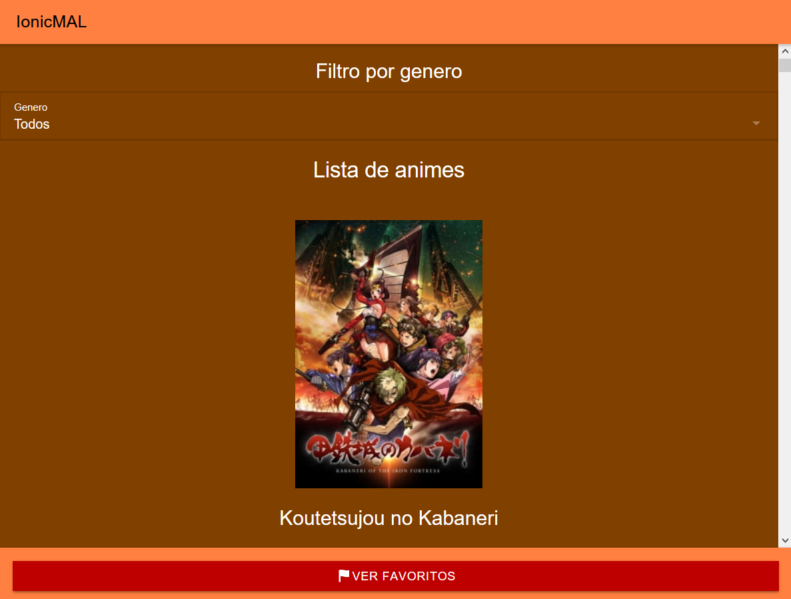
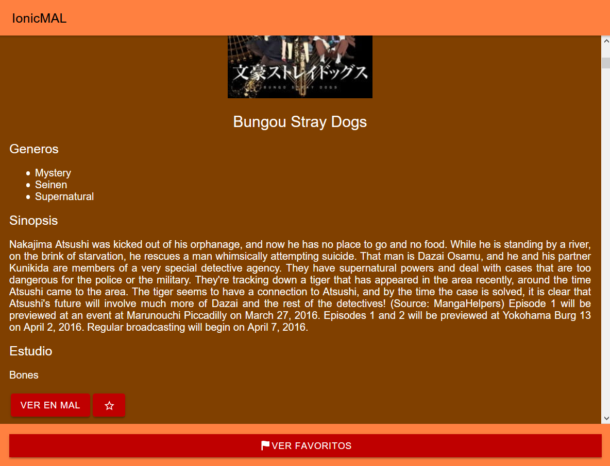

# Ionic My Anime List (Ionic MAL)

IonicMAL es una pequeña lista de animes que están en un archivo JSON, de los cuales puedes guardar tus favoritos.

Al clicar en uno de los elementos de la lista se muestran los detalles.

Debajo de los detalles, hay 2 botones, el primero te lleva a la página de My Anime List correspondiente al anime, el segundo guarda el anime en tu lista de Favoritos. Para ver la lista de favoritos hay que pulsar el botón de la parte inferior de la pantalla.

En la parte superior de la página hay un filtro que filtra la lista por géneros, mostrando solo los resultados que contengan ese género.

# Video explicativo

<iframe width="560" height="315" src="https://www.youtube.com/embed/ui57IxJW7ZM" frameborder="0" allow="accelerometer; autoplay; encrypted-media; gyroscope; picture-in-picture" allowfullscreen></iframe>
